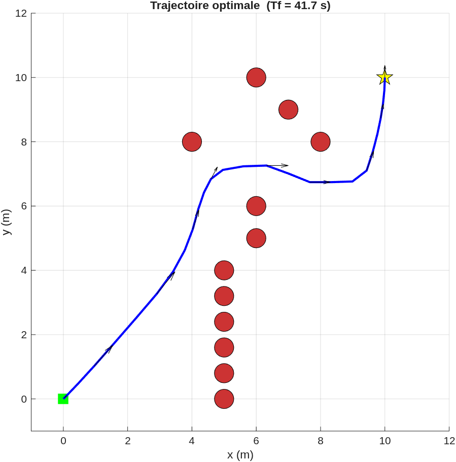

# 2D Boat Navigation

Simulation and optimal control of a boat navigating in a 2D environment with obstacles.

The objective is to compute an **optimal trajectory** allowing the boat to reach a target while avoiding obstacles, using a nonlinear dynamic model and a **Nonlinear Programming (NLP)** approach.


<p align="center">
  
</p>

## Project structure

- `init_params.m` — Physical parameters of the boat.
- `dyn.m` — Initial nonlinear dynamic model.
- `dyn2.m` — Robust formulation of the dynamic model.
- `scenario.m` — Scenario generation with obstacles.
- `scenario_random.m` — Random obstacle generation.
- `simu_dyn.m` — Simulation using the initial dynamic model.
- `simu_dyn2.m` — Simulation using the robust dynamic model.
- `simu_resolv.m` — Optimal trajectory computation.
- `simu_resolv2.m` — Optimal trajectory computation using the robust model.
- `figures/` — Figures generated from the simulations and optimization results.

## Requirements

[CasADi](https://web.casadi.org/)

## Model

The boat state is represented by:

$$
x = [x,\ y,\ \phi,\ v_x,\ v_y,\ r]^T
$$

The control inputs are the thrust $T$ and the rudder angle $\theta$.

The robust formulation uses the Cartesian velocity components $(v_x,v_y)$ to avoid the singularity that occurs when the boat velocity approaches zero.

## Optimal control problem

The optimization computes the states, control inputs and final time while satisfying:

- the boat dynamics;
- initial and final conditions;
- obstacle avoidance constraints;
- thrust and rudder limits;
- final-time bounds.

The target position is:

$$
(x_f,y_f) = (10,10)
$$

The optimal trajectory is obtained by discretizing the dynamics using **trapezoidal collocation** and solving the resulting NLP problem.

## Usage

1. Configure the physical parameters in `init_params.m`.
2. Select or generate a scenario using `scenario.m` or `scenario_random.m`.
3. Run the desired simulation or optimization script:
```matlab
simu_dyn2
````

or

```matlab
simu_resolv2
```

## Results

The optimization produces a trajectory that reaches the target while respecting the boat dynamics and avoiding the obstacles.

